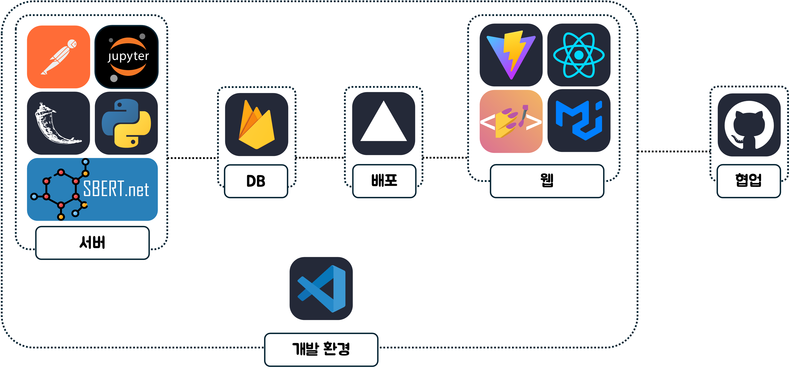

# 밀레니엄베이비즈 - 로컬 협업 매칭 플랫폼

## 서비스 요약
대구 지역 상인과 로컬 크리에이터를 연결하여 협업을 지원하는 온라인 매칭 플랫폼입니다. 이 서비스를 통해 상점들은 차별화된 상품을 제공하고, 로컬 크리에이터들은 자신의 아이디어를 사업화할 수 있습니다.

## 주제 구분
- C타입: 대구 지역 상권을 살리는데 도움을 주는 서비스

## 팀원 소개

| 전지웅 | 김동주 | 윤우린 | 홍송은 |
| :---: | :---: | :---: | :---: |
|  |  |  |  |
| 팀장 [📨](mailto:jun000628@naver.com) | 팀원 [📨](mailto:kdj4303@naver.com) | 팀원 [📨](mailto:yoonwoorin13@knu.ac.kr) | 팀원 [📨](mailto:hse2089@naver.com) |

## 시연 영상
[서비스 시연 영상 링크 (추가 예정)]  
(선택) [Github Repository](https://github.com/your-repo)에서 직접 확인 가능.

## 서비스 소개

### 서비스 개요
대구 지역의 상인과 로컬 크리에이터를 매칭하여 상점의 기존 상품에 크리에이터의 아이디어와 작품을 결합한 새로운 사업 가치를 창출하는 협업 플랫폼입니다. 이를 통해 상점은 차별화된 상품을 제공하고, 로컬 크리에이터는 사업 기회를 확대할 수 있습니다.

### 타서비스와의 차별점
- **매칭 시스템**: 브랜드 철학과 디자인 컨셉에 맞춘 협업 매칭 시스템을 통해, 상점과 로컬 크리에이터 간 높은 시너지를 발휘할 수 있습니다.
- **추천 알고리즘**: 상점과 크리에이터가 지정한 관심 키워드를 바탕으로 적합한 협업 상대를 추천하는 알고리즘을 제공합니다.
- **커뮤니티 형성**: 상점과 크리에이터 간의 긴밀한 네트워크 형성을 지원하여 장기적 협업을 촉진합니다.

### 구현 내용 및 결과물
[🚀 배포된 웹사이트 URL](https://2024-sw-hackathon.vercel.app/)
1. **협업 매칭 시스템**: 상점과 로컬 크리에이터가 서로 협업을 신청하고 적합한 파트너를 찾을 수 있습니다.
2. **추천 기능**: 상점과 크리에이터의 철학 및 디자인 스타일에 맞는 파트너를 추천하는 알고리즘을 제공합니다.
3. **온라인 협업 페이지**: 매칭이 완료되면 온라인에서 협업 계획을 세우고 관리할 수 있습니다.

### 구현 방식
- **Frontend**: React (JS) / Material UI / Styled-components
- **Backend**: Python / Flask
- **AI 모델**: SentenceTransformer 기반 추천 시스템
- **Database**: Firebase
- **Deployment**: Vercel

## 향후 개선 혹은 발전 방안
1. **초기 사용자 확보**: 초기 프로모션을 통해 적극적인 참여를 유도하고, 협업 성공 사례를 홍보하여 유입을 촉진할 계획입니다.
2. **협업 실패 방지**: 매칭 성공률을 높이기 위해 철학과 스타일 분석을 통한 적합도 평가 기능을 강화할 예정입니다.
3. **수익 모델 추가**: 프리미엄 추천 기능과 오프라인 이벤트 및 워크숍을 통해 추가 수익을 창출할 수 있는 방안을 마련할 계획입니다.*
